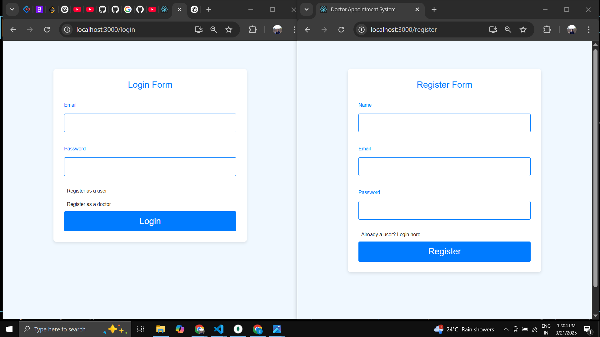

# DocDirect
A Doctor Appointment Booking System: Effortless Scheduling for Better Healthcare. 

This application is a comprehensive platform designed to streamline the process of booking doctor appointments. It provides a seamless user experience for patients, doctors, and administrators to manage and schedule appointments efficiently. The app includes the following features:

User (Patient) Features: Login/Registration, Book and View Appointments, 

Doctor Features: Login/Registration, Appointment Management, Profile Management, Availability Management

Admin Features:
Appointment Management, Admin can manage both user (patient) and doctor accounts. Admin has an overview of all appointments and can manage them as needed. The system provides secure login functionality for all users and doctors and ensures that both patients and doctors have the tools they need to manage appointments effectively. Admins have a comprehensive control panel to manage users, doctors, and appointments, ensuring a smooth operation of the entire platform.

By combining these features into one integrated platform, this app creates a more efficient, organized, and user-friendly environment for managing healthcare appointments.

## Setup 
Pls install nodejs and vscode in local

install npm by running code "npm install" in terminal

run "npm run dev" to run the app in local browser

in some seconds, app will start in your browser

## Result:
Login and Register page:

User Homepage:
.png)

Doctor Registration page:
.png)

Appointments List:
.png)

Admin Panel:
.png)

