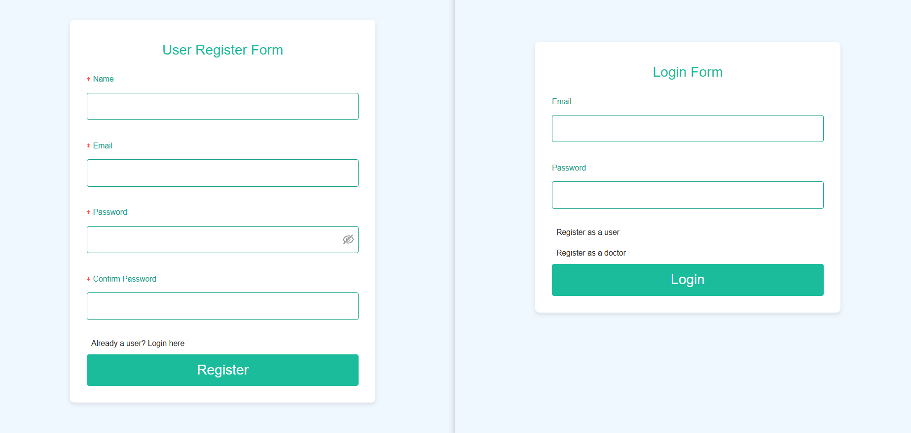
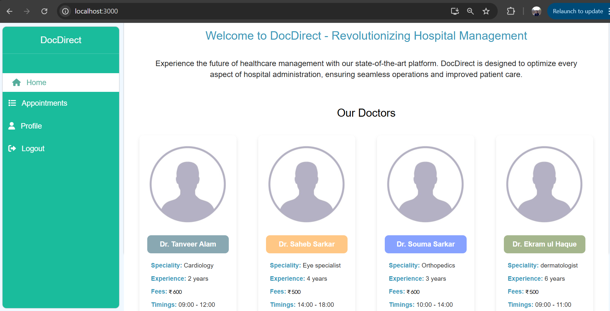
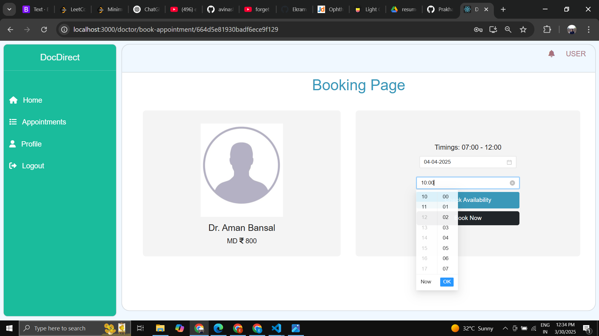
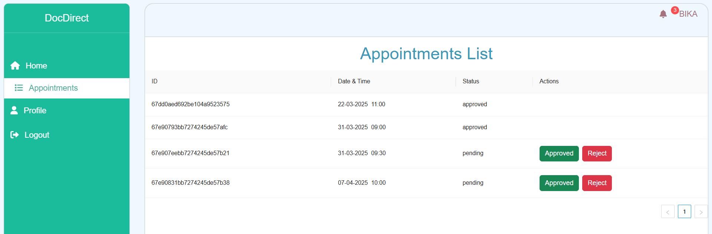
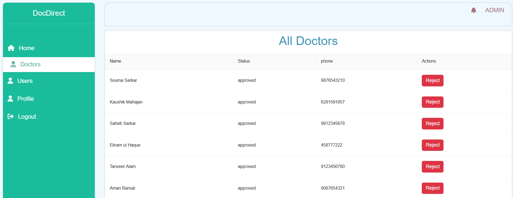
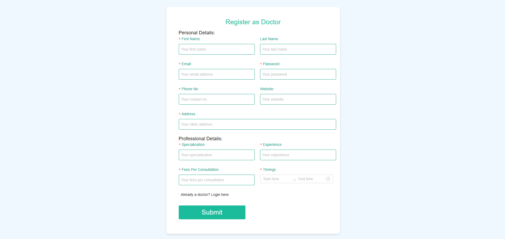

# DocDirect: An appointment booking system
## Introduction
A Doctor Appointment Booking System: Effortless Scheduling for Better Healthcare. 

This application is a platform designed to streamline the process of booking doctor appointments. It provides a seamless user experience for patients, doctors, and administrators to manage and schedule appointments efficiently.

### Benefits: 
Reduces scheduling conflicts, Reduces wait time, Verified doctors, Notifications, appointment tracking, doctor dashboard.

## Features:
* User, Doctor and Admin interfaces.
* User (Patient) Features: Login/Registration, book and view appointments from a vast range of diversified doctors.
* Doctor Features: Login/Registration, appointment management, profile management, availability management.
* Authentication & Authorization: Secure login and registration with JWT-based authentication.
* RESTful API Integration: Efficient communication between client and server.
* Secure CRUD Operations: Ensuring robust data transactions with MongoDB.

## Setup
### Prerequisites
Ensure that you have VS code, Node.js and MongoDB installed on your system. 

Steps to run
1. Clone the repository: 
```bash
git clone https://github.com/Ekram-ul-haque/DocDirect-1.git
cd DocDirect-1
code .
```

2. Install dependencies:
```bash
npm install
cd client
npm install
cd ..
```
3. Configure environment variables: 
* Create a .env file in the root directory.
* Add the following variables and add your JWT_SECRET and MONGO_URL here:

```bash
PORT=8080
JWT_SECRET=your_secret_key
MONGO_URL=your_mongodb_connection_string
```
4. Run the application:
```bash
npm run dev
```

In some seconds, app will start in your browser.

## Result:
Login and Register page:


User Homepage:


Booking Page: 


Doctor Appointment Dashboard page:


Admin Panel approving doctors:


Doctor Register Form:

